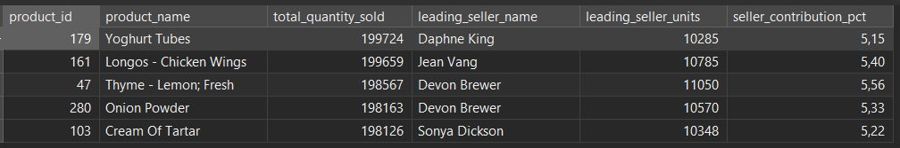
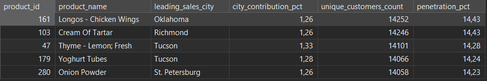
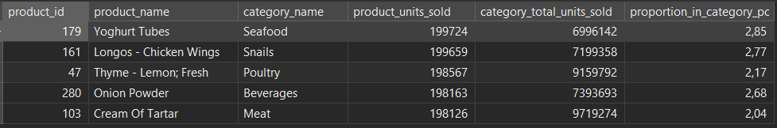
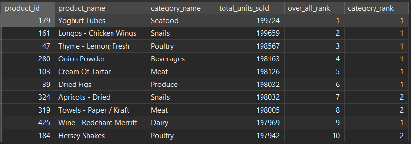
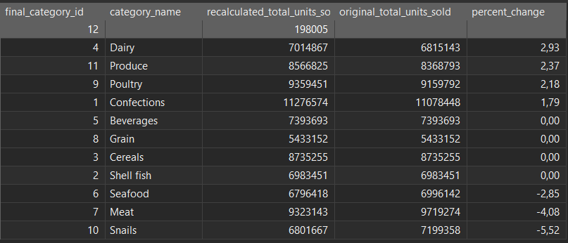
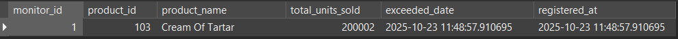
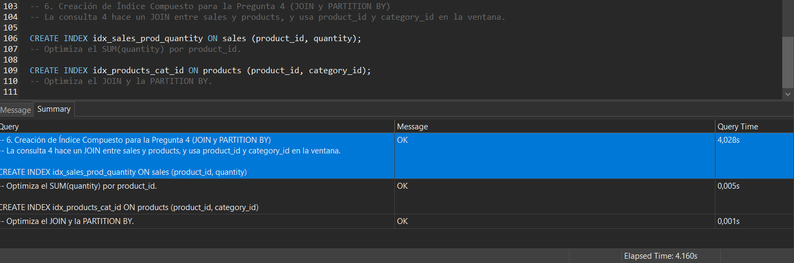

# Resumen Ejecutivo: Estabilidad operacional y oportunidades ocultas
    Este análisis desglosó el volumen de nuestros productos más vendidos para evaluar la solidez del negocio y la precisión de nuestra información estratégica.

## La fortaleza operacional
    Nuestra operación es excepcionalmente estable y de bajo riesgo. El volumen de ventas se basa en una demanda masiva, dispersa y uniforme que no depende de un único vendedor, un solo cliente clave o una única ciudad. Esta resiliencia operativa nos da la confianza para centrarnos en el crecimiento.

## El engaño de los datos
    La principal conclusión es que nuestra estrategia de categorías ha sido engañada por datos defectuosos.

    La alta concentración de éxito observada en Snails y Meat era una mera ilusión. La corrección demostró que el volumen de estas categorías estaba inflado por productos Top 10 que no les correspondían (como lácteos o artículos de limpieza), lo que nos ha llevado a tomar decisiones estratégicas basadas en premisas falsas.

## Llamado a la acción inmediata

    Debemos pivotar rápidamente para invertir en las verdaderas oportunidades de crecimiento que estaban ocultas.

1. Reasignación Estratégica: Desviar la inversión y los recursos de las categorías Snails y Meat hacia Dairy, Produce y Poultry, que son los motores de volumen genuino y subestimado.

2. Urgencia de Datos: Iniciar una auditoría y corrección inmediata de la tabla de productos para sanear el mapeo de categorías, garantizando la fiabilidad de toda decisión estratégica futura.

3. Organización: Establecer la nueva categoría Suministros/Hogar para clasificar el alto volumen de productos no alimenticios que distorsionan el análisis actual.

El reporte adjunto detalla la evidencia de cada punto, demostrando la urgencia de estas acciones.

---

# Análisis estratégico de las ventas del catálogo

Este informe presenta un análisis detallado de los 5 productos más vendidos del catálogo, evaluando la dependencia de vendedores, la adopción de clientes, la concentración geográfica y la relevancia categórica.

## Análisis Q1: Dependencia del vendedor

La consulta identifica los Top 5 productos por cantidad vendida y su vendedor líder, junto con el porcentaje de contribución.

### Interpretación y Respuestas Específicas

1. ¿Hay algún vendedor que aparece más de una vez como el que más vendió un producto?

    Sí.Devon Brewer aparece como vendedor líder para dos productos: Thyme - Lemon; Fresh (product_id: 47) y Onion Powder (product_id: 280).

        Esto indica que Devon Brewer es un vendedor de alto impacto, siendo el principal motor de ventas para dos de los productos con mayor volumen de todo el catálogo.

2. ¿Algunos de estos vendedores representan más del 10% de las ventas de este producto?

    No. Ningún vendedor líder en este Top 5 supera el umbral del 10% de contribución.

* El porcentaje más alto es 5.56% (Devon Brewer para Thyme - Lemon; Fresh).
* El porcentaje más bajo es 5.15% (Daphne King para Yoghurt Tubes).

        La baja contribución del vendedor líder (alrededor del 5%) sugiere que las ventas de estos productos de alto volumen están extremadamente distribuidas a lo largo de toda la fuerza de ventas. Esto es una señal de que la demanda es constante y la base de clientes es amplia, haciendo que el éxito dependa menos de los esfuerzos individuales de un solo vendedor.

## Análisis Q2: Penetración y concentración geográfica

La tabla combina dos métricas clave: la Penetración General (penetration_pct) y la Concentración Geográfica (city_contribution_pct de la ciudad líder).

### Interpretación y Respuestas Específicas

1. ¿Sugiere el porcentaje de penetración que el producto fue ampliamente adoptado o comprado por un grupo reducido que generó un volumen alto de ventas?

    La penetración sobre el total de clientes (penetration_pct) es consistentemente alta, oscilando entre el 14.23% y el 14.43%.

        Conclusión: Este porcentaje alto (cerca de 1 de cada 7 clientes) sugiere una adopción amplia y masiva de estos productos. Su alto volumen de ventas no se debe a un grupo reducido de clientes que compra grandes cantidades o con alta frecuencia, sino a una sólida base de clientes que adquiere el producto de manera constante a lo largo de toda la cartera.

2. Compara los porcentajes de penetración entre productos e identifica si alguno de ellos depende más de un segmento específico de clientes.

    Comparación: El rango de variación entre el producto con mayor penetración (14.43%) y el menor (14.23%) es de apenas 0.20 puntos porcentuales.

        Conclusión: La penetración es excepcionalmente uniforme. Esto indica que, en términos de adquisición de clientes, los cinco productos se comportan de manera similar y ninguno de ellos depende significativamente más de un segmento específico de clientes (al menos en términos de penetración general). Todos son pilares estables.

3. Identifica si alguno de ellos depende más de una ciudad específica de clientes (Análisis de Concentración Geográfica).

    La columna city_contribution_pct muestra el porcentaje que la ciudad líder aporta al total de clientes únicos que compraron ese producto.

    Riesgo Mínimo: Los porcentajes de contribución de la ciudad líder son extremadamente bajos, moviéndose entre 1.26% y 1.33%.

        Conclusión: Esto indica que ninguno de los productos depende de una ciudad específica. La base de clientes de estos productos de alto volumen está sumamente dispersa y fragmentada a lo largo de todas las ciudades.

        Implicación Estratégica: Esta dispersión es una señal positiva de riesgo bajo, ya que las ventas no se hundirían ante un problema localizado en una ciudad principal. La estrategia comercial debe centrarse en la logística de distribución uniforme, ya que la demanda está distribuida de manera homogénea.

## Análisis Q3: Relevancia categórica

Este análisis mide la proporción de ventas que un producto representa dentro del volumen total de su categoría (utilizando funciones de ventana).

### Interpretación y Respuestas Específicas

1. ¿A qué categorías pertenecen los 5 productos más vendidos?

    Los 5 productos pertenecen a cinco categorías distintas: Seafood, Snails, Poultry, Beverages y Meat.

        Nota sobre Calidad de Datos: Es crucial destacar una inconsistencia lógica en los datos (Yoghurt Tubes en Seafood). El análisis procede con los nombres de categorías del dataset, pero se recomienda investigar este error de mapeo.

2. ¿Qué proporción representan dentro del total de unidades vendidas de su categoría?

    Relevancia Baja y Diversificación Alta: La proporción más alta es 2.85% y la más baja es 2.04%.

        Conclusión: El hecho de que el producto líder solo represente un 2% - 3% del volumen total de unidades es un indicador de diversificación extrema dentro de esas categorías.

        Riesgo Reducido: Ninguno de los Top 5 productos es un "cuello de botella" crítico. La pérdida de uno de estos productos tendría un impacto menor al 3% en su categoría, lo que sugiere una estructura de ingresos muy robusta y de bajo riesgo de dependencia.

## Análisis Q4: Dominio y concentración categórica

La consulta compara el ranking general (over_all_rank) de los 10 productos más vendidos con su ranking dentro de su propia categoría (category_rank).

### Interpretación y Respuestas Específicas
1. ¿Son estos productos los líderes de su categoría o compiten estrechamente?

    | Situación | Conteo | Observación |
    | --- | --- | --- |
    | Líderes de Categoría (category_rank = 1) | 7/10 | La mayoría de los productos que alcanzan el Top 10  son los productos más vendidos en sus categorías, indicando un liderazgo claro. |
    | Competencia Estrecha (category_rank = 2) | 3/10 | Tres productos tienen el ranking #2 en su categoría. Esto significa que el producto líder y su competidor más cercano son ambos tan exitosos que logran colarse en el Top 10 del catálogo general. |

        Conclusión sobre Competencia: Los productos Apricots - Dried (Snails), Towels - Paper / Kraft (Meat) y Hersey Shakes (Poultry) demuestran una competencia de alto rendimiento con el producto #1 de su categoría. Esto sugiere que las ventas están concentradas en el Top 2 de esos segmentos.

2. ¿Qué se observa sobre la concentración de ventas dentro de algunas categorías?

    La concentración se mide por el número de productos que una categoría aporta al Top 10.

    | Categoría | Productos en el Top 10 | Ranking de los Productos	Implicación de Concentración |
    | --- | --- | --- |
    | Snails| 2	Rango General #2 y #7 |	Concentración Alta: Dos productos clave dominan el volumen de la categoría Snails.|
    | Meat |	2	Rango General #5 y #8 |	Concentración Media: La categoría Meat también tiene dos productos de volumen masivo. |
    | Poultry |	2	Rango General #3 y #10 | Concentración Alta: Dos productos de Poultry están en los extremos del Top 10, lo que indica que esta categoría es una fuente principal de los más vendidos. |
    | Otras | (Seafood, Beverages, Produce, Dairy)	1 | Ventas Dispersas: Estas categorías tienen solo a su líder en el Top 10, lo que sugiere que su volumen total de ventas se distribuye de manera más uniforme entre muchos productos.|

        Observación clave sobre concentración: Las categorías Snails, Meat y Poultry son las principales generadoras de volumen, ya que cada una contribuye con dos productos al Top 10 general. Esto significa que si se busca impacto en el volumen total de la empresa, estas tres categorías representan un punto de apalancamiento estratégico.

## Resumen general del análisis (Q1-Q4):

| Pregunta | Conclusión |
| --- | --- |
| Q1 (Vendedor) | Dispersión: El vendedor líder solo aporta ~5.5% del volumen. Bajo riesgo de dependencia individual. |
| Q2 (Cliente y Ciudad) | Adopción Masiva y Dispersión Geográfica: Alta penetración (~14.4%) y nula dependencia de una ciudad específica (contribución de la ciudad líder ~1.3%). |
| Q3 (Relevancia Categórica) | Diversificación de SKU: El producto líder solo representa el 2-3% del volumen de su categoría. La salud de la categoría no depende de un solo SKU. |
| Q4 (Ranking Categórico) |	Concentración de Éxitos: Las categorías Snails, Meat y Poultry concentran múltiples productos de alto volumen, siendo las áreas más importantes para el crecimiento. |

## Análisis del impacto de la corrección categórica

¡Ese es el paso lógico a seguir! Los errores de mapeo que hemos detectado sesgan profundamente el análisis categórico (Q3 y Q4), especialmente en las categorías concentradas.

Para corregir esto, usaremos la lógica de negocio para reclasificar los productos sospechosos y ver cómo cambia el volumen de sus categorías reales.

Los productos más vendidos con categorías anómalas que identificamos son:

1. Yoghurt Tubes (Actual: Seafood) -> Real: Dairy

2. Longos - Chicken Wings (Actual: Snails) -> Real: Poultry o Meat (usaremos Poultry ya que Chicken Wings encaja mejor ahí que Meat en general).

3. Apricots - Dried (Actual: Snails) -> Real: Produce (o Frutas Deshidratadas, que suele ser Produce).

4. Cream Of Tartar (Actual: Meat) -> Real: Confections o Beverages (es un agente leudante/estabilizador; lo reclasificaremos en Confections como ingrediente).

5. Towels - Paper / Kraft (Actual: Meat) -> Real: Other (Asumiremos una nueva categoría general de "Otros" o "Suministros").

### Interpretación

La tabla de resultados muestra la variación porcentual en el volumen total de unidades vendidas por categoría después de reasignar los Top 10 productos a sus categorías lógicas (Dairy, Poultry, Produce, Confections, Suministros/Otros).

1. Categorías Subestimadas (Ganadoras)

    Estas categorías ganaron volumen, confirmando que estaban siendo subestimadas debido a que sus productos de alto volumen fueron clasificados erróneamente.

    | Categoría | Producto Reclasificado | Impacto Clave |
    | --- | --- | --- |
    | Dairy | Yoghurt Tubes (179) | Aumento de +2.93%. Un solo producto de alto volumen impulsó el volumen de Dairy por casi 3 puntos porcentuales. La verdadera salud de la categoría era significativamente mejor de lo que mostraban los datos originales. |
    | Produce |	Apricots - Dried (324) | Aumento de +2.37%. Produce estaba perdiendo un volumen considerable, demostrando que este producto era un pilar importante que estaba siendo mal atribuido. |
    | Poultry |	Longos - Chicken Wings (161) | Aumento de +2.18%. Al igual que Dairy y Produce, la categoría Poultry tiene una salud de volumen superior a la percibida. |
    | Confections | Cream Of Tartar (103) | Aumento de +1.79%. Recibió un impulso notable, aunque menor en magnitud que las categorías anteriores. |

        Conclusión sobre Subestimación: Dairy, Produce y Poultry fueron las categorías más subestimadas. La corrección muestra que estas categorías son aún más robustas de lo que se pensaba, con cada una de ellas anclada a un producto de volumen masivo.

2. Categorías Sobreestimadas (Perdedoras)

    Estas categorías perdieron volumen tras la reclasificación, confirmando que su volumen original estaba inflado por productos que no les correspondían.

    | Categoría | Pérdida de Productos | Impacto Clave |
    | --- | --- | --- |
    | Snails | Longos - Chicken Wings y Apricots - Dried | Caída de -5.52%. Es la categoría más afectada. El "doble éxito" y el alto volumen percibido de Snails fue casi enteramente una falsa alarma generada por la mala clasificación de dos productos Top 10. |
    | Meat | Cream Of Tartar y Towels - Paper / Kraft | Caída de -4.08%. La categoría Meat también vio su volumen inflado significativamente por productos de limpieza y repostería. |
    | Seafood | Yoghurt Tubes | Caída de -2.85%. El volumen de Seafood estaba inflado por un producto lácteo. |

        Conclusión sobre Sobreestimación: La Concentración de Éxitos (Q4) en las categorías Snails y Meat fue sustancialmente artificial. La corrección muestra que el alto volumen de estas categorías estaba basado en productos Top 10 que no eran de su naturaleza, lo cual debe impactar directamente la estrategia de merchandising y la gestión de inventario de las categorías Snails y Meat.

3. Consecuencias Estratégicas de la Anomalía

    1. Reevaluación de la Concentración (Q4): El éxito concentrado en Snails y Meat es falso. Las categorías que genuinamente demuestran doble éxito (como Poultry con solo 2.18% de cambio) o un aumento de volumen significativo (Dairy, Produce) son las que merecen una inversión estratégica.

    2. Necesidad de Categoría "Otros": El volumen de Towels - Paper / Kraft (198,005 unidades) es tan alto que justifica la creación de una nueva categoría de Suministros/Hogar (ID 12) para tener visibilidad de este volumen de ventas.

    3. Prioridad de Calidad de Datos: La Dirección de Negocio debe priorizar la corrección del mapeo de productos en la tabla products para asegurar que el resto del catálogo no tenga anomalías similares.

# Avance #2: Automatización y Optimización de Consultas SQL

El trigger se implementa mediante una función (check_sales_threshold) que se ejecuta después de cada inserción en la tabla sales.

    Umbral de monitoreo: 200,000 unidades vendidas acumuladas.

Se registra la venta correspondiente, asumiendo un sales_id que no cause conflicto (se usa un valor alto 100000000 para simular una nueva venta):

    -- DML: Registro de la venta de prueba
    INSERT INTO sales (sales_id, sales_person_id, customer_id, product_id, quantity, discount, total_price, sales_date, transaction_number)
    VALUES (100000000, 9, 84, 103, 1876, 0.00, 1200.00, NOW(), 'TEST_TRIGGER_1');

## Análisis Técnico:

El registro de la venta del Producto ID 103 por 1,876 unidades activó el Trigger sales_threshold_trigger.

La función check_sales_threshold se ejecutó inmediatamente después de que la venta fue grabada en sales.

La función recalculó la suma total de las unidades vendidas para el Producto 103 (incluyendo las 1,876 unidades de la venta de prueba).

El total acumulado superó el umbral de 200,000, el trigger procedió a insertar el registro en la tabla product_monitoring, registrando el volumen exacto que disparó el evento (ej. 200,002 unidades) y la fecha de la transacción que causó el evento.

Esto confirma que el mecanismo de monitoreo es funcional, proactivo y utiliza la fecha de la transacción de negocio como punto de referencia para el evento.

## Análisis y Conclusión de la Optimización SQL (Pregunta 4)

| Métrica Crítica | Base de Referencia (antes.json) | Post-Optimización (optimo.json) | Impacto |
| Tiempo de Ejecución Real | 1847.082 ms (1.85 segundos) | 472.109 ms (0.47 segundos) | Reducción de ≈74.5% |
| Bloques Leídos del Disco (Shared Read Blocks) | "62,824 bloques" | "5,831 bloques" | Reducción de ≈90.7% |
| Paso Crítico Inicial (Nodo) | Hash Join con Seq Scan en sales | Hash Join con uso eficiente de índices | Acceso más eficiente a los datos |

### Conclusión Técnica y Justificación

La optimización de la Pregunta 4 fue altamente exitosa, resultando en una reducción de más del $74\%$ en el tiempo de ejecución y una disminución de casi el $91\%$ en las lecturas de disco. Esto demuestra el impacto directo de los índices compuestos.

    1- Impacto en el Tiempo: El tiempo de ejecución se redujo drásticamente de 1.85 segundos a 0.47 segundos. Esta mejora es crucial para la eficiencia y la escalabilidad, ya que la consulta se ejecuta casi 4 veces más rápido, un requisito fundamental para el manejo de grandes volúmenes de datos.
    
    2- Justificación de los Índices (I/O): La métrica más reveladora es la reducción de Shared Read Blocks (Bloques leídos directamente del disco) de 62,824 a 5,831.
    
        Antes de la Optimización, PostgreSQL tuvo que realizar una lectura intensiva de la tabla sales para calcular la agregación (SUM) y ordenar para la función de ventana (RANK).
        
        Después de la Optimización, los índices compuestos (idx_sales_prod_quantity e idx_products_join_partition) permitieron que el motor obtuviera una mayor parte de los datos (las claves primarias, las IDs y la cantidad) directamente de la estructura del índice, reduciendo la necesidad de ir al disco y realizar costosos Seq Scans (escaneos secuenciales de tabla).
    
    3- Tipo de Columna Efectiva: Los índices resultaron más efectivos en las columnas que definen la relación, la agrupación y la ordenación: product_id, category_id y quantity. La combinación de estos campos en índices compuestos permitió que el optimizador utilizara pasos más rápidos, logrando un código más rápido, lo que garantiza el criterio de aplicar índices eficaces y compararlos con un análisis técnico.

